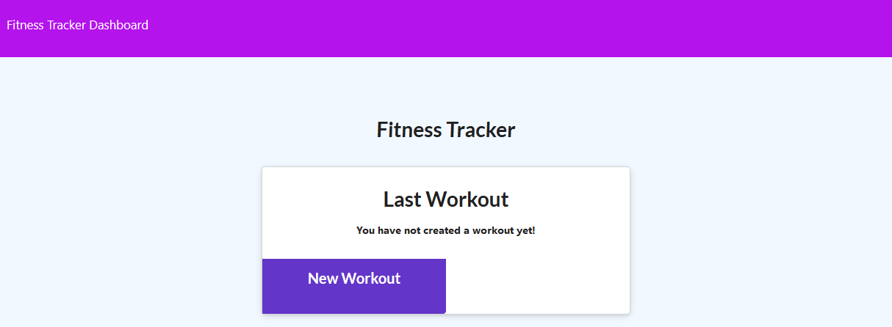
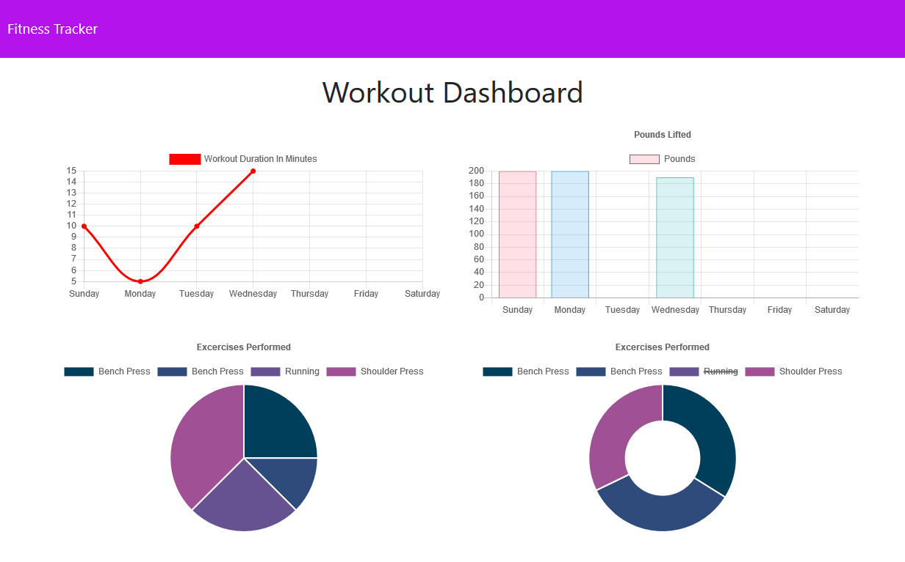

# Fitness Tracker

## About

The Fitness Tracker is a tool to let the user keep track of workouts they have completed over the week, and to also take in that data and provide the user with easy to read charts and graphs. The objective of the assignment is to create a Mongo database with a Mongoose schema, instead of using SQL. The app also requires the use of Express to handle routing. 

## Screenshots

The user will begin on a simple and clean landing page that will allow them to continue an old workout if one has been submitted, otherwise the only option is to begin a new workout.

This leads the user to a form where they can select the type of workout (Resistance or Cardio). When selected, the form will update to allow the user to fill in relevant bits of data to the workout type that was selected. If all of these fields are successfully completed, the user can then 'Complete' to enter the exercise into the database.

The user can click on 'Dashboard' on the main page to be sent to the Stats page, where any data that has been entered into the database will be used to populate good looking and easy to read graphs for the user.

## Technology

- NoSQL
- MongoDB
- Mongoose.js
- Express

## Links

- https://fitnesstracker-nk.herokuapp.com/
- https://github.com/marauder30/

## Author

[Nicholas Koch](https://marauder30.github.io/portfolio)